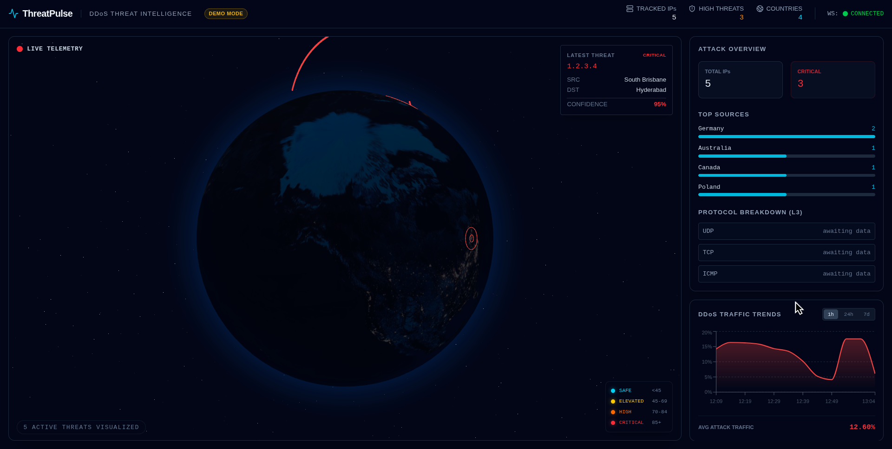

<div align="center">

# PYDDOS

**Real-Time DDoS Threat Intelligence & Visualization Platform**

An interactive cyber-threat intelligence platform that ingests malicious IP data, enriches it with geolocation, and streams attack events to a 3D global dashboard.


</div>


*ThreatPulse dashboard — interactive global threat visualization, telemetry, traffic trends, and live event feed.*

---

## Overview

ThreatPulse is a full-stack, real-time visualization platform built to monitor and analyze DDoS attacks and malicious IP intelligence. The application ingests data from external threat intelligence providers, validates and enriches it via a high-performance FastAPI backend, and streams live telemetry to a React-based frontend dashboard over WebSockets.

The core of the platform is an interactive, hardware-accelerated 3D Earth that visualizes active threat vectors using origin-to-destination arcs. A confidence-based classification system dynamically updates UI styling, providing immediate visual cues on threat severity. ThreatPulse features a resilient development mode (demo mode) to allow full application testing without exhausting strict external API quotas.

*Note: ThreatPulse visualizes data obtained from external API sources and uses simulated data in demo mode. It is designed to track recorded malicious activity, not to directly intercept live packets off the wire.*

## Features

### Interactive Threat Globe
- Dark satellite-style 3D Earth visualization using Three.js.
- Animated source → destination attack arcs.
- Pulsing origin indicators for new threats.
- Interactive rotation and zoom controls.
- Confidence-based visual styling and threat tooltips.

### Real-Time Dashboard
- Persistent WebSocket connectivity for instant updates.
- Live scrolling attack feed detailing IP, origin, and time.
- Attack telemetry overview including total tracked IPs and critical threat counts.
- Top source countries visualization.
- Connection status indicator.

### Threat Classification
ThreatPulse uses a centralized, confidence-based threat classification system derived from the intelligence source:

| Confidence Score | Threat Level | Color |
| :---: | :--- | :--- |
| **0–44** | SAFE / LOW | Cyan (`#22D3EE`) |
| **45–69** | ELEVATED | Yellow (`#FACC15`) |
| **70–84** | HIGH | Orange (`#F97316`) |
| **85+** | CRITICAL | Red (`#EF4444`) |

### Traffic Intelligence
- DDoS traffic trend chart using Recharts.
- Time period configuration for granular analysis.
- Layer 3 protocol breakdown overview (UDP, TCP, ICMP).

### Resilient Development Mode
- Configurable mock-data mode to bypass strict external API limits during active development.
- Exercises the entire end-to-end application pipeline (validation, routing, WebSockets, rendering) safely.

## Architecture

```text
                 External Threat Sources
              ┌──────────┬──────────────┐
              │AbuseIPDB │ Cloudflare   │
              │          │ Radar        │
              └─────┬────┴──────┬───────┘
                    │           │
                    ▼           ▼
              ┌─────────────────────┐
              │   FastAPI Backend   │
              │                     │
              │ ingestion/services  │
              │ validation          │
              │ geolocation         │
              │ in-memory state     │
              └─────────┬───────────┘
                        │
                REST + WebSocket
                        │
                        ▼
              ┌─────────────────────┐
              │ React + TypeScript  │
              │                     │
              │ Three.js Globe      │
              │ Threat Feed         │
              │ Statistics          │
              │ Traffic Charts      │
              └─────────────────────┘
```

## Data Flow

The lifecycle of an attack event through the system:

```text
Threat source (External API / Mock Generator)
    ↓
Malicious IP Identification
    ↓
Geolocation Enrichment
    ↓
Pydantic Validation (Data Contracts)
    ↓
AttackEvent Generation
    ↓
AttackArc Translation
    ↓
In-Memory Store / Deduplication
    ↓
REST & WebSocket Dispatch
    ↓
React Application State
    ↓
3D Globe + UI Rendering
```

## Tech Stack

| Layer | Technology | Purpose |
| :--- | :--- | :--- |
| **Frontend** | React, TypeScript | UI Architecture & Type Safety |
| | Vite | Build Tooling & Development Server |
| | Three.js / React Three Fiber | 3D WebGL Rendering |
| | Three Globe | Geographical Visualization Mapping |
| | TailwindCSS | Utility-first Styling |
| | Recharts | Traffic Trends Visualization |
| **Backend** | Python, FastAPI | Asynchronous API & WebSockets |
| | Pydantic | Data Validation & Settings Management |
| | HTTPX | Asynchronous HTTP Requests |
| **External Data** | AbuseIPDB | Threat Intelligence Source |
| | IP-API | Geolocation Enrichment |
| | Cloudflare Radar | Global Traffic & Trend Data |
| **Tooling** | uv | Ultra-fast Python package management |
| | npm | Frontend package management |

## Project Structure

```text
ThreatPulse/
├── backend/
│   ├── main.py             # FastAPI entrypoint
│   ├── config.py           # Environment settings
│   ├── models/             # Pydantic data schemas
│   ├── routers/            # API & WS route definitions
│   └── services/           # Ingestion & external API logic
│
├── frontend/
│   ├── src/
│   │   ├── components/     # React UI components (Globe, Feed, Charts)
│   │   ├── hooks/          # Custom hooks (useWebSocket)
│   │   ├── services/       # Frontend API clients
│   │   ├── utils/          # Helpers (Threat classification)
│   │   └── types/          # TypeScript interfaces
│   └── package.json
│
└── README.md
```

## API Overview

ThreatPulse exposes a set of REST endpoints for initial state hydration and a WebSocket endpoint for real-time updates.

| Method | Endpoint | Description |
| :--- | :--- | :--- |
| `GET` | `/health` | Application health check |
| `GET` | `/api/attacks/arcs` | Retrieve active attack arcs |
| `GET` | `/api/attacks/stats` | Retrieve global attack statistics |
| `POST` | `/api/attacks/refresh` | Force an immediate data fetch from sources |
| `GET` | `/api/trends/http` | Fetch HTTP traffic trend data |
| `GET` | `/api/trends/layer3` | Fetch Layer 3 protocol telemetry |
| `WS` | `/ws` | Primary WebSocket endpoint for live updates |

Interactive API documentation is available during local development at: `http://127.0.0.1:8000/docs`.

## WebSocket Flow

The dashboard relies on a persistent WebSocket connection to stream processed threat events without requiring HTTP polling.

**Server → Client:**
- `init`: Hydrates the initial client state upon connection.
- `new_arc`: Streams a newly detected and processed attack vector.
- `stats_refresh`: Pushes updated global statistics.
- `pong`: Responds to client keep-alives.

**Client → Server:**
- `ping`: Sent periodically to maintain connection health.

## Local Development

### Backend Setup
The backend utilizes [uv](https://github.com/astral-sh/uv) for fast dependency management.

```bash
cd backend
uv sync
uv run fastapi dev main.py
```
*Note: Copy `.env.example` to `.env` to configure your environment. Do not commit actual API keys.*

### Frontend Setup
The frontend uses Vite and standard NPM tooling.

```bash
cd frontend
npm install
npm run dev
```

### Accessing the Application
- **Frontend Dashboard:** `http://localhost:5173`
- **Backend API:** `http://127.0.0.1:8000`
- **Swagger Documentation:** `http://127.0.0.1:8000/docs`

## Environment Variables

ThreatPulse is configured via a backend `.env` file. Do not expose actual credentials.

- `ABUSEIPDB_API_KEY`
- `CLOUDFLARE_API_TOKEN`
- `ABUSEIPDB_CONFIDENCE_THRESHOLD`
- `ABUSEIPDB_LIMIT`
- `ATTACK_POLL_INTERVAL`
- `TRENDS_POLL_INTERVAL`
- `USE_MOCK_DATA`

By setting `USE_MOCK_DATA=true`, the application will use internal mock generators to populate the dashboard, allowing you to develop without consuming external API quotas. Setting `USE_MOCK_DATA=false` will ingest live data from configured external sources.

## Demo vs Real Data

ThreatPulse supports a robust demo/mock mode for development because external threat intelligence APIs often enforce strict rate limits and quotas. 

- **Demo Mode:** Uses simulated, highly-realistic sample threat records to drive the dashboard and test UI resilience.
- **Real Mode:** Interfaces with configured external API integrations to visualize actual threat observations.

*The dashboard should not imply that simulated events in demo mode are confirmed live attacks.*

## Roadmap (Future Work)

- PostgreSQL persistence and historical attack replay.
- Redis caching and robust state management.
- Richer filtering and advanced search capabilities.
- Automated testing suite.
- Docker and Docker Compose containerization.
- CI/CD pipelines via GitHub Actions.
- Cloud deployment and infrastructure as code.
- Improved backend observability.
- Integration with additional threat-intelligence feeds.

## Engineering Highlights

- **Asynchronous Processing:** Non-blocking external API communication using `httpx`.
- **Type Safety & Validation:** Strict structured data contracts using Pydantic on the backend and TypeScript on the frontend.
- **Modular Architecture:** Clean separation of concerns using FastAPIs router/service architecture.
- **Real-Time Streaming:** Efficient WebSocket-based UI updates bypassing expensive HTTP polling.
- **Resilient Engineering:** Built-in API quota-aware mock/fallback modes.
- **Smart Data Handling:** In-memory attack deduplication.
- **Unified Design System:** Centralized confidence-based threat visualization.
- **Decoupled Architecture:** Clean separation between backend ingestion engines and frontend 3D presentation layers.

---

### Disclaimer

*ThreatPulse is an educational and portfolio threat-intelligence visualization project. It visualizes data obtained from configured intelligence sources and simulation data in demo mode. It should not be interpreted as a complete, enterprise-grade view of global DDoS activity.*

## Roadmap (Future Scope)

- PostgreSQL persistence for historical threat data and attack replay.
- Redis caching for frequently accessed threat intelligence and application state.
- Advanced filtering by country, confidence score, IP, and time range.
- Historical analytics and attack-pattern exploration.
- Automated backend and frontend testing.
- Docker and Docker Compose containerization.
- CI/CD pipelines with GitHub Actions.
- Production deployment with monitoring and observability.
- Integration with additional threat-intelligence feeds.
- Rate-limit-aware ingestion, caching, and retry strategies.
- Alerting for high-confidence threat events.